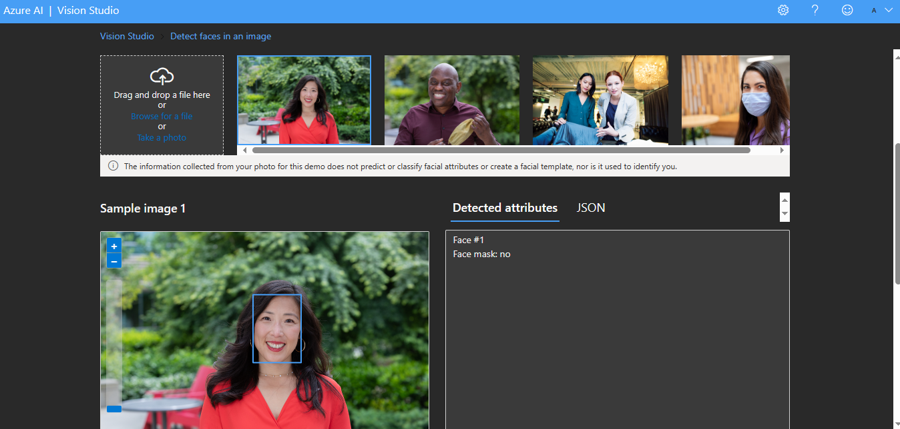

# Reconhecimento Facial e transformação de imagens em Dados no Azure ML

Passo a passo do projeto Reconhecimento Facial e Transformação de imagens em Dados no Azure ML da DIO.

## 1 - Criando recurso e detectando rosto

Abrindo o portal Azure. Cliquei em "Create a resourse" na imagem.

Em "categorias". Cliquei na opção "IA + Machine Learning"

Pesquisei por "Azure AI services". Cliquei em "create, seguindo a documentação proposta".

Ao criar abrir o Vision Studio ([azure.com](https://portal.vision.cognitive.azure.com/gallery/featured))

Alterando o tema para o modo "Dark". Cliquei em "View All Resources" e selecionado o recurso criado "LabRF-TI" (Referênte ao nome do curso "Reconhecimento Facial e transformação de imagens em Dados no Azure ML").

Ao clicar no "X" foi retornado para a página inicial e selecionada a opção "Face".

Cliquei em "Detect Faces In na Image" e selecionado o "Try It Out"

A imagem e o rosto da pessoa foi detectado com o atributo e o código em JSON

[Clique aqui para ver o código](output/DetectandoRosto.json)

## 2 - Análise de documentos

Retornei a página inicial e selecionada a opção em "Optical Character Recognition" para fazer análise de caracteres e abrir o "Extract text from images".

[Clique aqui para ver o código](output/AnaliseDeDocumentos.json)

## 3 - Análise de imagem
Retornado novamente, cliquei em "Image Analysis"

E escolhi a opção "Add Dense Captions To Images". Selecionando uma imagem, ele traz toda a descrição em atributos e o código JSON e a descrição serve também como acessibilidade.

[Clique aqui para ver o código](output/AnaliseDeImagem.json)

